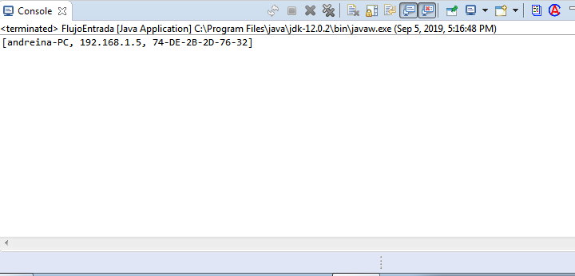

# ProjectoMac
Obtiene los datos de la computadora que lo ejecuta y lo envia por medio de sockets 

#Consta de dos clases para implementar la prueba del programa

#Se debe correr ejecutar la clase flujoentrada para que abra el puerto elegido(defecto 9999) y
escuche en el la informacion.

#Luego en la clase flujosalida tomara los datos de red de la computadora en forma de lista [Nombre de la maquina, IP , Direccion Mac]

#La informacion obtenida la imprimira en consola, para hacer un uso mas extensivo de la informacion se puede cambiar la direccion ip 
y el puerto a una aplicacion o servidor distintos desechando el uso de la clase flujoentrada como clase de prueba.

Imagen de demostracion 

